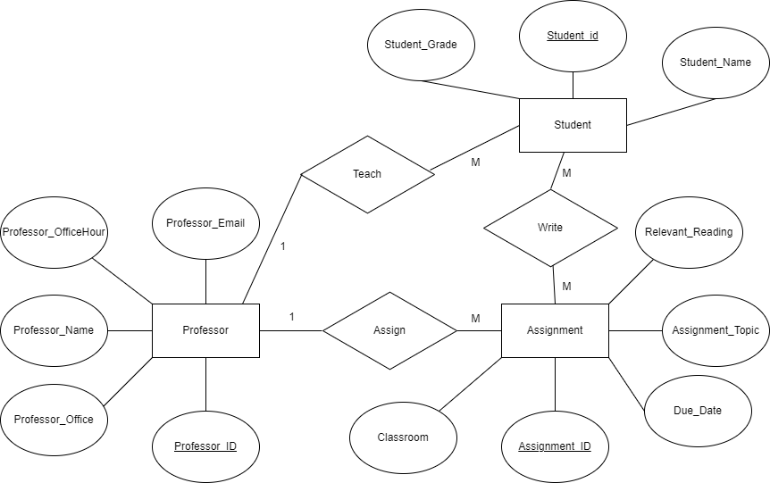

# Data Normalization and Entity-Relationship Diagramming

## Modify the Data Set to fulfill 4NF

### Original Data Set

+ Below is the original data set we have:

| assignment_id | student_id | due_date | professor | assignment_topic                | classroom | grade | relevant_reading    | professor_email   |
| :------------ | :--------- | :------- | :-------- | :------------------------------ | :-------- | :---- | :------------------ | :---------------- |
| 1             | 1          | 23.02.21 | Melvin    | Data normalization              | WWH 101   | 80    | Deumlich Chapter 3  | l.melvin@foo.edu  |
| 2             | 7          | 18.11.21 | Logston   | Single table queries            | 60FA 314  | 25    | Dümmlers Chapter 11 | e.logston@foo.edu |
| 1             | 4          | 23.02.21 | Melvin    | Data normalization              | WWH 101   | 75    | Deumlich Chapter 3  | l.melvin@foo.edu  |
| 5             | 2          | 05.05.21 | Logston   | Python and pandas               | 60FA 314  | 92    | Dümmlers Chapter 14 | e.logston@foo.edu |
| 4             | 2          | 04.07.21 | Nevarez   | Spreadsheet aggregate functions | WWH 201   | 65    | Zehnder Page 87     | i.nevarez@foo.edu |
| ...           | ...        | ...      | ...       | ...                             | ...       | ...   | ...                 | ...             

### Data Set's Problem and Solution Summary

+ The original table does not fulfill the requirment of 4NF during the data designation. To analyze the table, We suppose in the data set the primary key is assignment_id and student_id. 
+ For 1NF, everything fulfilled. We don't need to modify the data set based on it.
+ For 2NF, the data set don't fulfill its rule since there are **partial dependencies**. In the data set, due_date, professor, assignment_topic, classroom, relevant_reading are only related to assignment_id, not student_id. To solve this problem, we split the data into different pairs of tables and all of these tables have one primary key which is assignment_id. In this way, the partial dependencies problem is solved.
+ For 3NF, the data set don't fulfill its rule since there are **transitive dependencies**. The professor_email attribute depends on the non-prime attribute professor. To solve this problem, we split the data into multiple tables to make professor email and professor name only depends on professor id.
+ For 4NF, the data set don't fulfill its rule since there are **multivalued dependencies**. Both professor_email and professor, student_id and grade have this problem. To solve this problem, we also split the data up into multiple tables so that the data set won't be multivalued.

### Correct Data Set Building and Explanation

+ Create **Topic Table**, which has two columns, primary key is assignment_id, and another column is assignment_topic. In this table, we can find out different assignment's topic name according to their assignment_id.

| assignment_id |  assignment_topic
| :------------ | :---------  
| 1             | Data normalization 
| 2             | Single table queries
| 4             | Spreadsheet aggregate functions
| 5             | Python and pandas
| ...           | ... 

+ Create **Due Date Table**, which has two columns, primary key is assignment_id, and another column is due_date. In this table, we can find out different assignment's different due date according to their assignment_id.

| assignment_id |  due_date
| :------------ | :---------  
| 1             | 23.02.21 
| 2             | 18.11.21
| 4             | 04.07.21
| 5             | 05.05.21
| ...           | ... 

+ Create **Relevant Reading Table**, which has two columns, primary key is assignment_id, and another column is relevant_reading. In this table, we can find out different assignment's relevant reading according to their assignment_id.

| assignment_id | relevant_reading
| :------------ | :---------  
| 1             | Deumlich Chapter 3 
| 2             | Dümmlers Chapter 11
| 4             | Zehnder Page 87
| 5             | Dümmlers Chapter 14
| ...           | ... 

+ Create **Assignment Classroom Table** and **Classroom Name Table**, In the first table, there are two columns, primary key is assignment_id, and another column is classroom_id. In the second table, there are also two columns, primary key is classroom_id, and another column is classroom_name. These two tables can be combined with the foreign key classroom_id. With these two tables, we can find out which classroom should we go to attend class according to the assignment we are doing.

| assignment_id |  classroom_id
| :------------ | :---------  
| 1             | 1 
| 2             | 2
| 4             | 3
| 5             | 2
| ...           | ... 

| classroom_id |  classroom_name
| :------------ | :---------  
| 1             | WWH 101 
| 2             | 60FA 314
| 3             | WWH 201
| ...           | ... 

+ Create **Assignment Professor Table**, **Professor Name Table** and **Professor Email Table**, In the first table, there are two columns, primary key is assignment_id, and another column is professor_id. In the second table, there are also two columns, primary key is professor_id, and another column is professor_name. In the third table, there are also two columns, primary key is professor_id, and another column is professor_email. These three tables can be combined with the foreign key professor_id. With these three tables, we can find out each assignments' responsible professor and these professor's email address.

| assignment_id |  professor_id
| :------------ | :---------  
| 1             | 1 
| 2             | 2
| 4             | 3
| 5             | 2
| ...           | ... 

| professor_id |  professor_name
| :------------ | :---------  
| 1             | Melvin 
| 2             | Logston
| 3             | Nevarez
| ...           | ... 

| professor_id |  professor_email
| :------------ | :---------  
| 1             | l.melvin@foo.edu 
| 2             | e.logston@foo.edu
| 3             | i.nevarez@foo.edu
| ...           | ... 

+ Create **Assignment Student Grade**, which has three columns, primary key is assignment_id and student_id and another column is grade. In this table, based on the combination data of student_id and assignment_id, we can find out an exact student's grade in an exact assignment.

| assignment_id |  student_id | grade
| :------------ | :---------- | :------
| 1             | 1           | 80
| 1             | 4           | 75
| 2             | 7           | 25
| 4             | 2           | 65
| 5             | 2           | 92
| ...           | ...         | ...

+ In this way, finally, we build up a data set that fuilfill 4NF requirments.

## Draw an Entity-Relationship Diagram

